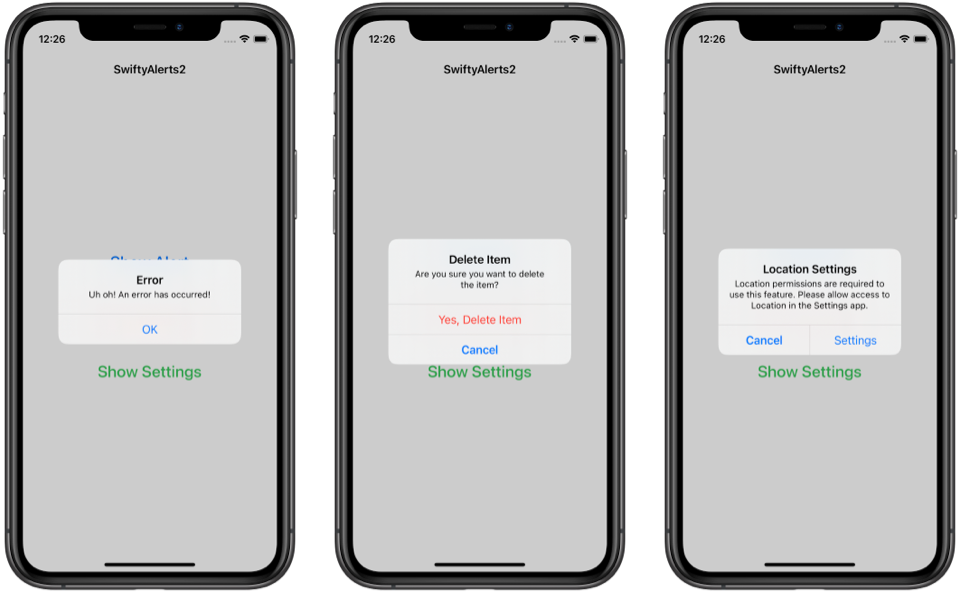

# SwiftyAlerts2
Example of showing 3 different alert styles using SwiftUI and an [.alert](https://developer.apple.com/documentation/swiftui/view/alert(_:ispresented:presenting:actions:message:)-3md6l) presentation modifier.

  

